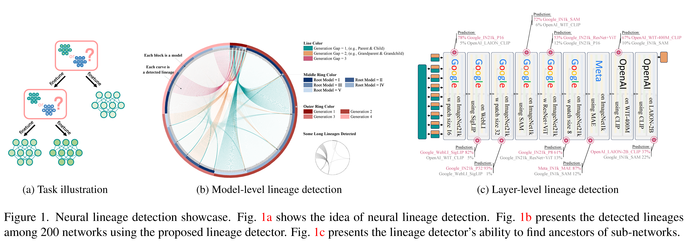

<!-- Improved compatibility of back to top link: See: https://github.com/othneildrew/Best-README-Template/pull/73 -->
<a name="readme-top"></a>
<!--
*** Thanks for checking out the Best-README-Template. If you have a suggestion
*** that would make this better, please fork the repo and create a pull request
*** or simply open an issue with the tag "enhancement".
*** Don't forget to give the project a star!
*** Thanks again! Now go create something AMAZING! :D
-->

<div align="center" style="font-size:5vw;"><strong>Neural Lineage</strong></div>
<div align="center" style="font-size:2vw;margin-bottom:3vh;"> Detect the ancestors for any well-tuned neural network.</div>
<div align="center" style="font-size:2vw"><a href="https://yu-rp.github.io/">Runpeng Yu</a> and <a href="https://sites.google.com/site/sitexinchaowang/">Xinchao Wang</a></div>
<div align="center" style="font-size:2vw;"><a href="http://lv-nus.org/">Learning and Vision Lab</a> @ National University of Singapore</div>
<hr />
<div align="center" style="font-size:2vw;">
    <a href="about:blank"><strong>Paper (CVPR 2024 Oral)</strong></a> 
    | <a href="about:blank"><strong>PDF</strong></a>
    | <a href="about:blank"><strong>Poster</strong></a>
    | <a href="about:blank"><strong>Video</strong></a>
</div>
<div align="center">
    
</div>

<br style="margin-bottom:3vh;">
<!-- TABLE OF CONTENTS -->
<!-- <details> -->
<summary style="font-size: 3vw;">Table of Contents</summary>
<ul>
  <li style="font-size: 2vw;"><a href="#updates_and_todos">Updates and TODOs</a></li>
  <li style="font-size: 2vw;"><a href="#environment-setup">Environment Setup</a></li>
  <li style="font-size: 2vw;"><a href="#data-preparation">Data Preparation</a></li>
  <li style="font-size: 2vw;"><a href="#pre-trained-models">Pre-trained Models</a></li>
  <li><a href="#learning-free-method-and-baselines">Learning-Free Method and Baselines</a></li>
  <li style="font-size: 2vw;"><a href="#lineage-detector">Lineage Detector</a></li>
</ul>
<!-- </details> -->

## Updates and TODOs
- [ ] Upload the parent and child models used in the experiment
- [ ] Upload the dataset used for training and evaluating lineage detector

## Environment Setup
Our code only requires minimal packages. All the code is implemented using Python 3.8.10 and PyTorch 2.0.0 on an RTX3090 with CUDA 12.0. Using other versions of the required packages should also be fine. All the relied packages are listed in the `environment.yaml` file. Run the following code, which will creates and activates a virual environment named *lineage*.

```bash
conda env create -f environment.yaml
conda activate lineage
```
<p align="right">(<a href="#readme-top">back to top</a>)</p>

## Data Preparation
The data used in the work are all standard **torchvision.datasets** and are saved in the `data` folder by default. Dataset are loaded using the `get_loader` function in the `src/utils.py` file. The choice of dataset is controled by the attribute `dataset` of `args`.

<p align="right">(<a href="#readme-top">back to top</a>)</p>

## Pre-trained Models
The pre-trained models are stored by default in `models` folder. The `.json` files in the `archive` folder summarize the parent and child models, which will be used in the experiments.

<p align="right">(<a href="#readme-top">back to top</a>)</p>

## Learning-Free Method and Baselines

The following command is to run the learning-free methods or the baselines.

```sh
cd src

python learningfree.py \
        --model network-architecture \ # e.g., FC
        --dataset fine-tuning-dataset \ # e.g., FMNIST
        --pre-train-ckpt-json-p ../arcive/parents.json \
        --pre-train-ckpt-json-c ../arcive/children.json \
        --method name-of-the-method \ # e.g., representation_approxl2, representation_l2
        --batch-size number-of-samples-for-similarity-evaluation \ # e.g., 1024
        --alpha alpha-in-the-paper #e.g., 0.01
```

<p align="right">(<a href="#readme-top">back to top</a>)</p>

## Lineage Detector

The step before trianing lineage detector is to prepare the dataset for it. The following code will automatically prepare a dataset for the `FC+FMNIST` setup.

```sh
cd src/lineagedetector

python dataset.py
```

The following command is to train the lineage detector the logged reuslt will also included the performance evaluation.

```sh
cd src

python learningbased.py \
        --batch-size 16 \
        --datasets dataset-name \ # e.g., FC-FMNIST
        --lr 0.01 \
        --epochs 100
```

<p align="right">(<a href="#readme-top">back to top</a>)</p>